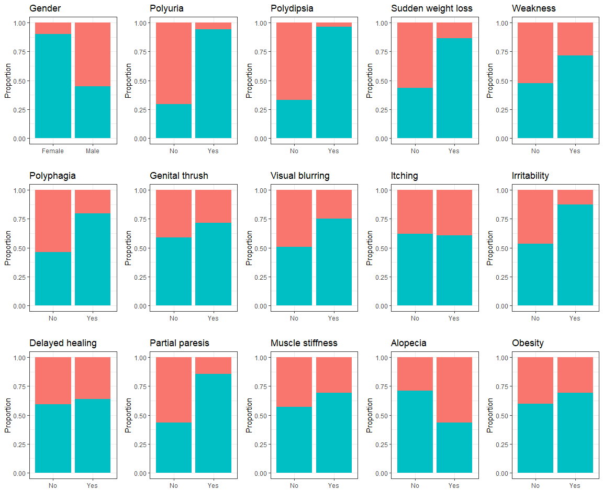

Early Detection of Diabetes Using Classification
================

### Introduction

The dataset contains 520 observations of patients' age, gender, signs, symptoms, and diagnosis of diabetes. The aim of this project is to develop a model for early prediction of diabetes using the dataset. I will train the model using a random sample of 80% of observations from the dataset and validate the trained model using the other 20% of observations. I will use two classification methods, logistic regression and random forest, and evaluate both models using the receiver operating characteristic (ROC) curve.

**Attribute Information:**

-   **Age**: 16-90
-   **Gender**: Male, Female
-   **Polyuria**: Yes, No
-   **Polydipsia**: Yes, No
-   **Sudden weight loss**: Yes, No
-   **Weakness**: Yes, No
-   **Polyphagia**: Yes, No
-   **Genital thrush**: Yes, No
-   **Visual blurring**: Yes, No
-   **Itching**: Yes, No
-   **Irritability**: Yes, No
-   **Delayed healing**: Yes, No
-   **Partial paresis**: Yes, No
-   **Muscle stiffness**: Yes, No
-   **Alopecia**: Yes, No
-   **Obesity**: Yes, No
-   **Class**: Positive, Negative

### Exploratory Data Analysis

-   61.5% of total patients tested positive.
-   38.5% of total patients tested negative.

-   Most non-diabetic patients between their mid 30's and mid 50's do not have diabetes.
-   Most diabetic patients between their late 30's and early 60's have diabetes.
-   The median age of diabetic patients is higher than that of non-diabetic patients.
    

-   Females have a significantly higher proportion of positive diagoses than that of males.
-   Those who experienced polyuria, polydipsia, sudden weight loss, irritability, and partial paresis had a significantly high proportion of positive diagnoses.
-   Those who experienced weakness, polyphagia, genital thrush, visual blurring, muscle stiffness, and obesity had a moderately high proportion of positive diagnoses.

### Logistic Regression

The logistic regression model will predict the probability of a patient developing diabetes, where Positive = 1, Negative = 0.
The dependent variable is denoted by y, and the independent variables are denoted by x.

Logisic Response Function: 

=\frac{1}{1+e^{-(\beta_0+\beta_1x_1+\beta_2x_2+...+\beta_kx_k)}}")

Then, 

 = 1-P(y=1) = 1-\frac{1}{1+e^{-(\beta_0+\beta_1x_1+\beta_2x_2+...+\beta_kx_k)}}")

We can also use the odds to rewrite the equation:

}{P(y=0)}")

Then the log odds or Logit function is:

=\beta_0+\beta_1x_1+\beta_2x_2+...+\beta_kx_k")

#### Model Summary:

<table class="table table-striped table-hover table-condensed table-responsive" style="width: auto !important; margin-left: auto; margin-right: auto;">
<tbody>
<tr>
<td style="text-align:left;font-weight: bold;">
Observations
</td>
<td style="text-align:right;">
423
</td>
</tr>
<tr>
<td style="text-align:left;font-weight: bold;">
Dependent variable
</td>
<td style="text-align:right;">
class
</td>
</tr>
<tr>
<td style="text-align:left;font-weight: bold;">
Type
</td>
<td style="text-align:right;">
Generalized linear model
</td>
</tr>
<tr>
<td style="text-align:left;font-weight: bold;">
Family
</td>
<td style="text-align:right;">
binomial
</td>
</tr>
<tr>
<td style="text-align:left;font-weight: bold;">
Link
</td>
<td style="text-align:right;">
logit
</td>
</tr>
</tbody>
</table>
<table class="table table-striped table-hover table-condensed table-responsive" style="width: auto !important; margin-left: auto; margin-right: auto;">
<tbody>
<tr>
<td style="text-align:left;font-weight: bold;">
X²(5)
</td>
<td style="text-align:right;">
415.94
</td>
</tr>
<tr>
<td style="text-align:left;font-weight: bold;">
Pseudo-R² (Cragg-Uhler)
</td>
<td style="text-align:right;">
0.85
</td>
</tr>
<tr>
<td style="text-align:left;font-weight: bold;">
Pseudo-R² (McFadden)
</td>
<td style="text-align:right;">
0.74
</td>
</tr>
<tr>
<td style="text-align:left;font-weight: bold;">
AIC
</td>
<td style="text-align:right;">
159.08
</td>
</tr>
<tr>
<td style="text-align:left;font-weight: bold;">
BIC
</td>
<td style="text-align:right;">
183.36
</td>
</tr>
</tbody>
</table>
<table class="table table-striped table-hover table-condensed table-responsive" style="width: auto !important; margin-left: auto; margin-right: auto;">
<thead>
<tr>
<th style="text-align:left;">
</th>
<th style="text-align:right;">
Est.
</th>
<th style="text-align:right;">
S.E.
</th>
<th style="text-align:right;">
z val.
</th>
<th style="text-align:right;">
p
</th>
</tr>
</thead>
<tbody>
<tr>
<td style="text-align:left;font-weight: bold;">
(Intercept)
</td>
<td style="text-align:right;">
2.12
</td>
<td style="text-align:right;">
0.57
</td>
<td style="text-align:right;">
3.72
</td>
<td style="text-align:right;">
0.00
</td>
</tr>
<tr>
<td style="text-align:left;font-weight: bold;">
GenderMale
</td>
<td style="text-align:right;">
-4.76
</td>
<td style="text-align:right;">
0.68
</td>
<td style="text-align:right;">
-6.99
</td>
<td style="text-align:right;">
0.00
</td>
</tr>
<tr>
<td style="text-align:left;font-weight: bold;">
PolyuriaYes
</td>
<td style="text-align:right;">
5.17
</td>
<td style="text-align:right;">
0.73
</td>
<td style="text-align:right;">
7.12
</td>
<td style="text-align:right;">
0.00
</td>
</tr>
<tr>
<td style="text-align:left;font-weight: bold;">
PolydipsiaYes
</td>
<td style="text-align:right;">
5.32
</td>
<td style="text-align:right;">
0.82
</td>
<td style="text-align:right;">
6.51
</td>
<td style="text-align:right;">
0.00
</td>
</tr>
<tr>
<td style="text-align:left;font-weight: bold;">
ItchingYes
</td>
<td style="text-align:right;">
-3.15
</td>
<td style="text-align:right;">
0.63
</td>
<td style="text-align:right;">
-5.01
</td>
<td style="text-align:right;">
0.00
</td>
</tr>
<tr>
<td style="text-align:left;font-weight: bold;">
IrritabilityYes
</td>
<td style="text-align:right;">
2.01
</td>
<td style="text-align:right;">
0.55
</td>
<td style="text-align:right;">
3.66
</td>
<td style="text-align:right;">
0.00
</td>
</tr>
</tbody>
<tfoot>
<tr>
<td style="padding: 0; border: 0;" colspan="100%">
 Standard errors: MLE
</td>
</tr>
</tfoot>
</table>

-   Gender, Polyuria, Polydipsia, Itching, and Irritability are very significant.
-   Polydipsia, Polyruia, and Gender are important variables in predicting diabetes.

#### Odds Ratio Plot With 95% Confidence Interval

-   Those who experienced polyuria or polydipsia were much more likely to have diabetes than those who did not experience these symptoms. 

#### Confusion Matrix

We visualize the performance of our model using a confusion matrix. The selected threshold is 0.5. 

-   If Prediction &lt;= 0.5, then it will be Class 0 (Negative).
-   If Prediction &gt; 0.5, then it will be Class 1 (Positive).

-   Accuracy = 87.6%
-   Misclassification rate = 12.4%
-   92.1% of all non-diabetic patients were correctly classified.
-   84.7% of all diabetic patients were correctly classified.

#### ROC Curve

Next, we look at the ROC curve, which summarizes the confusion matrices that each threshold produces. The y-axis shows the True Positive Rate (Sensitivity) and the x-axis shows the False Positive Rate (1-Specificity).

The area under the ROC curve measures the performance across all thresholds. A high AUC indicates that the model accurately distinguishes between diabetic and non-diabetic patients.

-   The area under the curve is high (0.946), indicating high accuracy.
-   There is a trade-off for changing the threshold:
    -   Increasing the threshold would decrease the true positive rate and decrease the false positive rate.
    -   Decreasing the threshold would increase the true positive rate and increase the false positive rate.

### Random Forest

The random forest algorithm creates a forest with a collection of decision trees, where in each decision tree a random subset of features is chosen at each split and a random sample of training data is used. Then, each tree casts a vote for a prediction, and the algorithm chooses the classification with the most votes.

Below is a plot of one tree:

It works like this:

Starting at node 1, if a patient has polyuria, we go to node 2. Next, if a patient has polydipsia, we go to node 8, the decision node, which shows the probabilities of the response variable.
In the decision node, a decision is made based on a sample of 164 patients who have been in that situation. The dark rectangle shows the probability of the patient having a positive diagnosis. We see that the probability is about 1, or about 100% chance that the patient has diabetes, so this tree predicts that the patient has diabetes.

#### Model Summary

Here are the results of 500 trees and 4 variables at each split:

    ## Type of random forest: classification
    ## Number of trees: 500
    ## No. of variables tried at each split: 4
    ## 
    ##         OOB estimate of  error rate: 2.6%
    ## Confusion matrix:
    ##          Negative Positive class.error
    ## Negative      156        6  0.03703704
    ## Positive        5      256  0.01915709

-   Out of bag error rate is 2.6%, which is low (about 97.4% accuracy).
-   Predictions for Negative and Positive are both good.
-   Errors for positive predictions are slightly lower than that of negative predictions.
    -   3.7% of the true negative cases were falsely classified as positives.
    -   1.9% of the true positive cases were falsely classified as negatives.

#### Hyperparameter Tuning

The training data with 500 trees gives the following error plot of Out of Bag (black), Negative (red), and Positive (green):

-   The error rates decrease as the number of trees increase and stabilizes at around 200 trees.

**OOB Error vs mtry**

-   OOB error is lowest at mtry = 4, or 4 variables at each split.

Here are the results of 200 trees and 4 variables at each split:

    ## Type of random forest: classification
    ## Number of trees: 200
    ## No. of variables tried at each split: 4
    ## 
    ##         OOB estimate of  error rate: 2.36%
    ## Confusion matrix:
    ##          Negative Positive class.error
    ## Negative      156        6  0.03703704
    ## Positive        4      257  0.01532567

-   The OOB error rate decreased from 2.6% to 2.36%.
-   The error of positive class decreased slightly.

#### Confusion Matrix

-   Accuracy = 96.9%
-   Misclassification rate = 3.1%
-   97.4% of all non-diabetic patients were correctly classified.
-   96.6% of all diabetic patients were correctly classified.

#### Variable Importance

We use the variable importance plot to see which variables are important. The plots show the average decrease in accuracy and gini impurity (the probability of misclassification) if the variable was removed from the model. A higher mean decrease in accuracy and Gini impurity suggests that the variable is more important.

-   Polyuria, gender, and polydipsia have high contributions to accuracy.
-   Polyuria and polydipsia have high contributions to Gini impurity
-   Muscle stiffness, genital thrush, obesity, and weakness have very little contributions to accuracy and Gini impurity.

#### ROC Curve

The ROC of random forest with 200 trees and 4 variables at each split is plotted:

-   The area under the ROC curve is very high (0.997), indicating almost perfect accuracy.

### Discussion

A brief summary of both models:

**Logistic Regression**

-   Accuracy: 87.6%
-   Sensitivity: 84.7%
-   Specificity: 92.1%
-   AUC: 0.946

**Random Forest**

-   Accuracy: 96.9%
-   Sensitivity: 96.6%
-   Specificity: 97.4%
-   AUC: 0.9973

In the end, I was able to predict both positive and negative cases with good accuracy using logistic regression and random forest. In addition, both models identified polyuria, polydipsia, and gender as powerful predictors. However, the random forest model has higher accuracy, sensitivity, specificity, and area under the ROC curve than those of the logisitic regression model. Thus, the random forest model appears to outperform the logistic regression model.

Some advantages of logistic regression is that it is computationally efficient, easy to train, and results are easy to interpret. Disadvantages are that it requires the assumption of linearity between the predictors and the log odds of the response variable, and there are more steps to data preparation, such as handling missing values.
Some advantages of random forest are that it can solve both regression and classification problems, and can detect linear and nonlinear relationships. In addition, it can handle missing values well and parameters can be tuned to alter model performance. Disadvantages of random forest are that it is difficult to interpret, and it is memory-intensive for very large data, which can take the model longer to train and make predictions.
